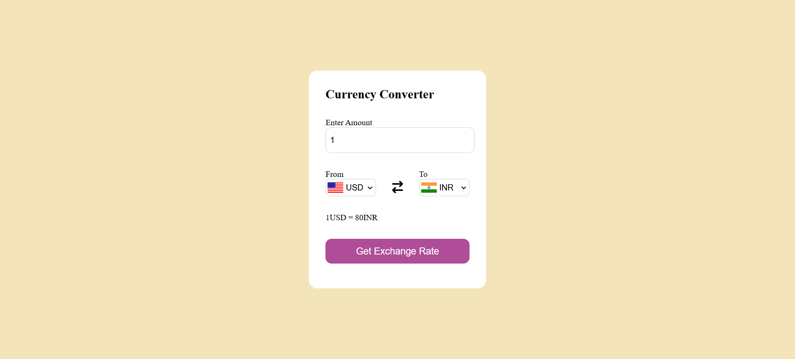

# Currency Converter

A simple web-based currency converter that allows users to convert between different currencies using real-time exchange rates.

## Features

- Select source and target currencies from dropdowns with country flags.
- Enter the amount to convert.
- Fetches exchange rates from a public API.
- Displays the converted amount and updates country flags dynamically.

## Project Structure

- [`index.html`](index.html): Main HTML file with the UI.
- [`style.css`](style.css): Styles for the app.
- [`codes.js`](codes.js): Contains the currency code to country code mapping.
- [`app.js`](app.js): Main JavaScript logic for fetching rates and updating the UI.

## Usage

1. Open `index.html` in your browser.
2. Select the currencies and enter the amount.
3. Click "Get Exchange Rate" to see the conversion.

## Dependencies

- [Font Awesome](https://cdnjs.cloudflare.com/ajax/libs/font-awesome/6.5.1/css/all.min.css) for icons.

## API

Exchange rates are fetched from:  
`https://raw.githubusercontent.com/WoXy-Sensei/currency-api/main/api`

## Screenshot

Add a screenshot of the app below (replace the example path with your actual screenshot):

---